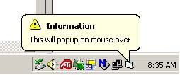



## Balloon ToolTips

### Description

Shows balloon tooltips in the notification tray(systray). This code works where others fall short. Able to update the balloon tooltip and it will disappear. Other codes used on mouse over would leave balloon up, clicking would not remove.
 
### More Info
 
Pass the form, tip text, tip title, icon desired, choose the style (balloon or standard.)

             |
---                |---
**Submitted On**   |2002-06-13 08:58:46
**By**             |[Pat Sinclair](https://github.com/Planet-Source-Code/PSCIndex/blob/master/ByAuthor/pat-sinclair.md)
**Level**          |Intermediate
**User Rating**    |4.9 (39 globes from 8 users)
**Compatibility**  |VB 6\.0
**Category**       |[Windows API Call/ Explanation](https://github.com/Planet-Source-Code/PSCIndex/blob/master/ByCategory/windows-api-call-explanation__1-39.md)
**World**          |[Visual Basic](https://github.com/Planet-Source-Code/PSCIndex/blob/master/ByWorld/visual-basic.md)
**Archive File**   |[Balloon\_To939766132002\.zip](https://github.com/Planet-Source-Code/pat-sinclair-balloon-tooltips__1-35794/archive/master.zip)

### API Declarations

in zip file.

